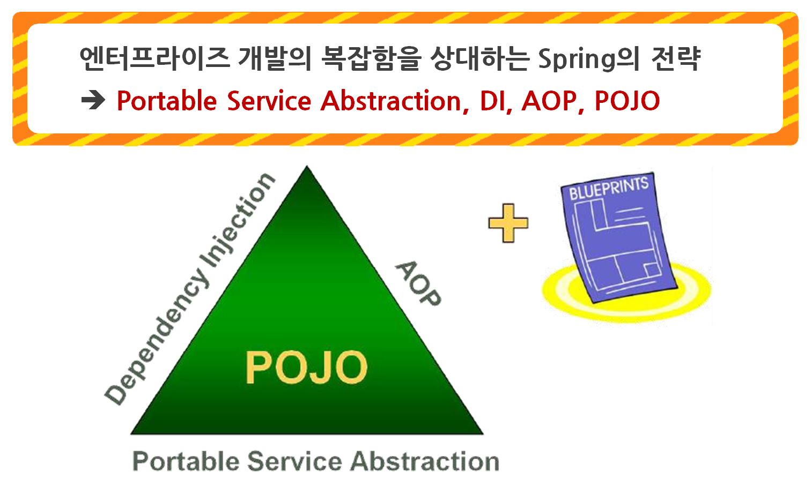
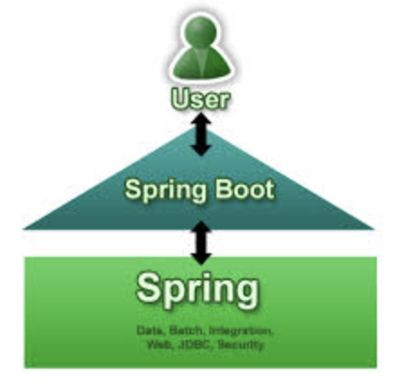

# 📘 Spring & Spring Boot

## 1. 학습 목표
- Spring & Spring Boot 개념 이해
- 실습 환경 구축
- Git 터미널 환경 익히기

## 2. Spring & Spring Boot 개념 이해
### 2.1 🌱Spring

스프링 공식 문서에서는 Spring Framework를 아래와 같이 설명합니다. 

*The Spring Framework provides a comprehensive programming and configuration model for modern Java-based enterprise applications - on any kind of deployment platform.* 

Spring Framework는 모든 종류의 배포 플랫폼에서 최신 Java 기반 엔터프라이즈 애플리케이션을 위한 포괄적인 프로그래밍 및 구성 모델을 제공합니다.  

*A key element of Spring is infrastructural support at the application level: Spring focuses on the "plumbing" of enterprise applications so that teams can focus on application-level business logic, without unnecessary ties to specific deployment environments.* 

Spring의 핵심 요소는 애플리케이션 레벨에서의 인프라 지원입니다. Spring은 특정 배포 환경에 불필요한 연결 없이 팀이 애플리케이션 레벨 비즈니스 로직에 집중할 수 있도록 엔터프라이즈 애플리케이션 plumbing(규약)에 초점을 맞춥니다.
이 말은 곧 Spring Framework는 개발자가 비즈니스 로직에 집중할 수 있도록, Java 기반 엔터프라이즈 애플리케이션을 위한 종합적인 기능들을 지원한다는 뜻입니다.   

- **애플리케이션 프레임워크** :    
    특정 계층이나 기술, 업무 분야에 국한되지 않고 애플리케이션의 전 영역을 포괄하는 범용적인 프레임워크를 말한다.
    
- **경량급 프레임워크** :    
    단순한 웹컨테이너에서도 엔터프라이즈 개발의 고급기술을 대부분 사용할 수 있다.
    
- **엔터프라이즈 개발용이** :     
    개발자가 복잡하고 실수하기 쉬운 Low Level에 많이 신경쓰지 않으면서 Business Logic 개발에 전념할 수 있도록 해준다.
    
- **오픈 소스** :    
    Spring은 OpenSource의 장점을 충분히 취하면서 동시에 OpenSource 제품의 단점과 한계를 잘 극복한다.
  

### 2.2 🌱Spring 전략

- **Portable Service Abstraction(서비스 추상화)**    
    트랜잭션 추상화, OXM 추상화, 데이터 액세스의 Exception 변환기능 등 기술적인 복잡함은 추상화를 통해 Low Level의 기술 구현 부분과 기술을 사용하는 인터페이스로 분리한다.
    
- **객체지향과 DI(Dependency Injection)**    
    Spring은 객체지향에 충실한 설계가 가능하도록 단순한 객체 형태로 개발할 수 있고, DI는 유연하게 확장 가능한 객체를 만들어 두고 그 관계는 외부에서 다이내믹하게 설정해준다.
    
- **AOP(Aspect Oriented Programming)**    
    AOP는 애플리케이션 로직을 담당하는 코드에 남아 있는 기술 관련 코드를 분리해서 별도의 모듈로 관리하게 해주는 강력한 기술이다.
    
- **POJO(Plain Old Java Object)**    
    POJO는 객체지향 원리에 충실하면서, 특정 환경이나 규약에 종속되지 않고 필요에 따라 재활용될 수 있는 방식으로 설계된 객체이다.

### 2.3 🌼Spring Boot

스프링부트 공식 문서에서는 Spring Boot를 아래와 같이 설명합니다.

Spring Boot makes it easy to create stand-alone, production-grade Spring based Applications that you can "just run". We take an opinionated view of the Spring platform and third-party libraries so you can get started with minimum fuss. Most Spring Boot applications need minimal Spring configuration.  

Spring Boot는 단독 실행되는, 상용화 가능한 수준의 스프링 기반 애플리케이션을 쉽게 만들어 낼 수 있습니다. 최소한의 설정으로 스프링 플랫폼과 서드파티 라이브러리들을 사용할 수 있도록 하고 있습니다.
즉,  **우리는  Spring Boot를 이용해서 스프링 기반 애플리케이션을 쉽게 만들 수 있다 는 뜻입니다.**
  

### 2.4 🌼Spring Boot 특징

- **간결한 설정**    
    스프링 부트는 번거로운 XML 설정이 필요 없으며, 최소한의 설정으로 Spring을 사용할 수 있고, **기본적인 설정을 자동으로 처리하므로 개발자가 많은 설정 작업을 하지 않아도 된다.** 설정으로 인한 불편사항을 해소하여 개발자는 애플리케이션 개발에 집중할 수 있다.
    
- **내장 서버**    
    **스프링 부트는** 내장된 서버(내장 Tomcat, Jetty, Undertow)를 제공하여 **별도의 서버 설정 없이 애플리케이션을 실행할 수 있다.**
    
- **의존성 관리 간소화**    
    **스프링 부트**는 여러 3rd party 라이브러리를 사용할 때, 발생하는 라이브러리 버전 충돌로 인한 문제를 해결하기 위해서, 이미 **테스트된 여러 라이브러리들의 묶음 패키지를 제공**한다.
    
- **운영 편의성**    
    스프링 부트는 애플리케이션의 상태 모니터링, 로깅, 보안 설정 등 운영에 필요한 기능들을 제공하므로, 이를 통해 애플리케이션의 운영과 관리가 편리해지고 안정성이 향상된다.

## 3. 🌱Spring & Spring Boot🌼 차이점

<table>
  <tr>
    <th style="width: 150px;">항목</th>
    <th style="width: 400px;">Spring Framework</th>
    <th style="width: 400px;">Spring Boot</th>
  </tr>
  <tr>
    <td>목적/철학</td>
    <td>- 핵심 기능(IOC/DI 컨테이너, AOP, 트랜잭션, MVC, 데이터 접근 등)을 
    모듈로 제공하는 범용 프레임워크. - “넓은 선택지 + 세밀한 제어”가 장점. 초기 설정과 선택을 개발자가 직접 책임.</td>
    <td>- 스프링을 빠르고 일관되게 쓰도록 돕는 실행 플랫폼/스타터. - “합리적인 기본값 + 자동 설정 + 내장 서버”가 핵심. 설정 부담을 최소화.</td>
  </tr>
  <tr>
    <td>의존성 관리</td>
    <td>각 라이브러리 버전을 직접 선정·호환성 관리</td>
    <td>Starter POM(+ BOM)으로 기능 묶음 제공, 버전 정합성 자동 보장</td>
  </tr>
  <tr>
    <td>설정 방식</td>
    <td>XML/Java Config 중심의 명시적 설정 많음</td>
    <td>Auto Configuration으로 기본 빈 자동 구성, 필요한 부분만 오버라이드</td>
  </tr>
  <tr>
    <td>서버(실행)</td>
    <td>보통 외부 WAS(Tomcat/Jetty) 설치 후 WAR 배포</td>
    <td>내장 서버(Tomcat/Jetty/Undertow) 포함, java -jar 즉시 실행</td>
  </tr>
  <tr>
    <td>프로젝트 구성</td>
    <td>직접 폴더 구성, 의존성 수동 추가</td>
    <td>Spring Initializr로 스캐폴딩, 즉시 실행 가능한 뼈대 제공</td>
  </tr>
  <tr>
    <td>설정 파일</td>
    <td>프레임워크/라이브러리별 다양한 설정 분산</td>
    <td>application.yml/properties 단일 진입점에 환경·프로파일 정리</td>
  </tr>
  <tr>
    <td>테스트</td>
    <td>Spring TestContext 공용</td>
    <td>@SpringBootTest, @WebMvcTest, @DataJpaTest 등 슬라이스 테스트 지원 강화</td>
  </tr>
  <tr>
    <td>패키징</td>
    <td>WAR 중심(전통 WAS 배포 패턴에 적합)</td>
    <td>Fat JAR 기본(내장 서버), 필요 시 WAR도 지원</td>
  </tr>
</table>
  

