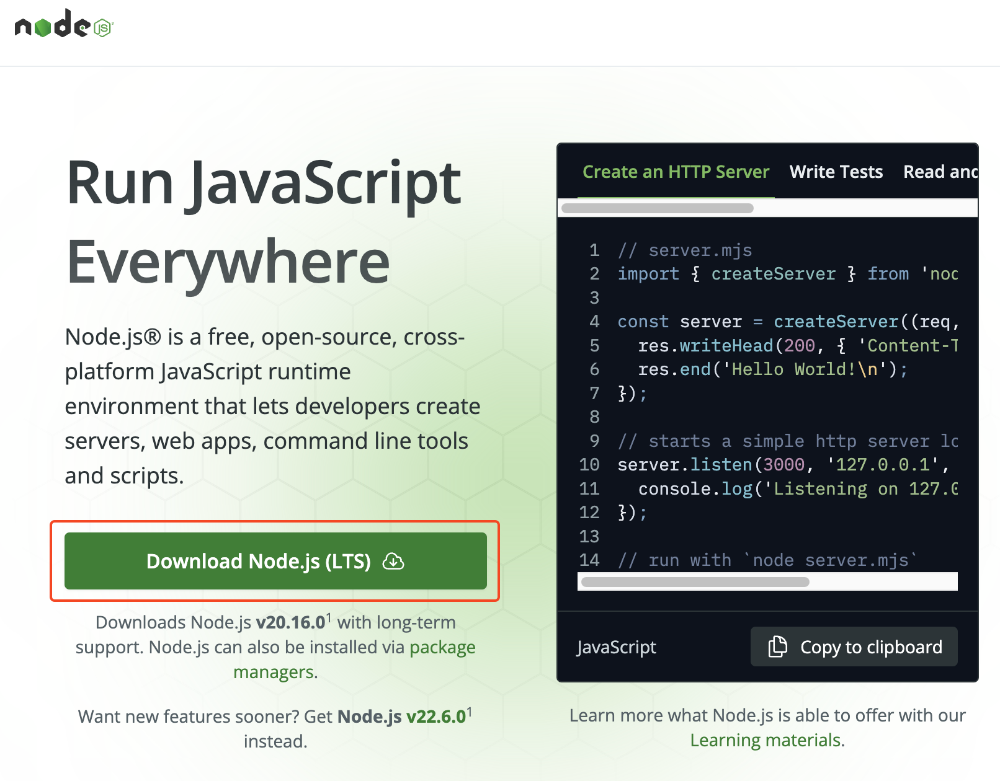
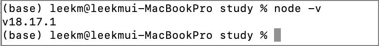
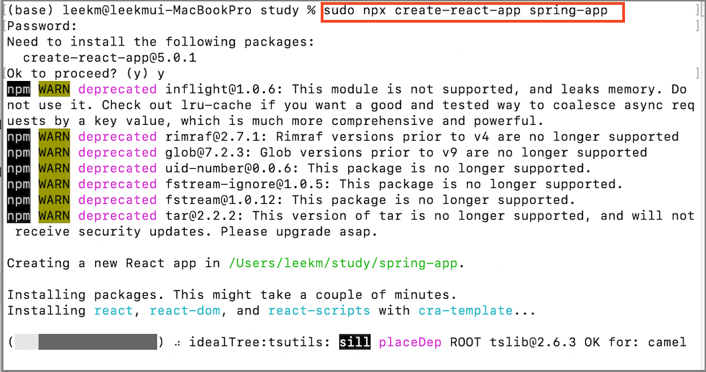
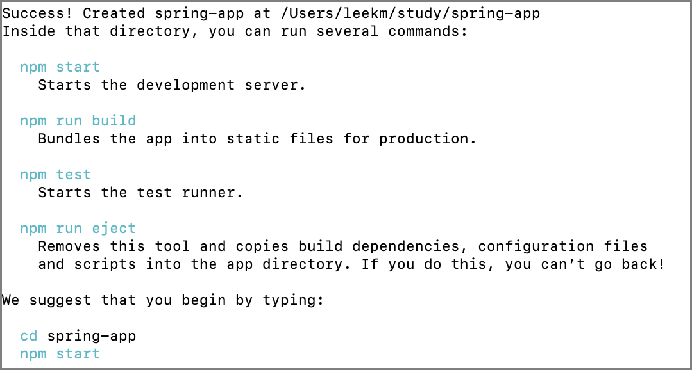
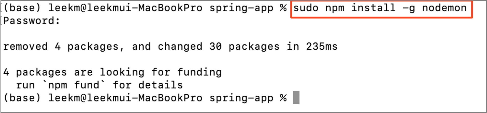
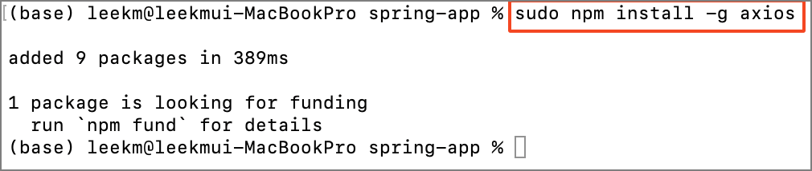
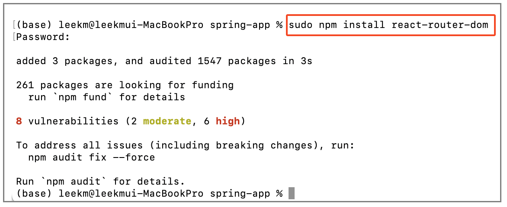
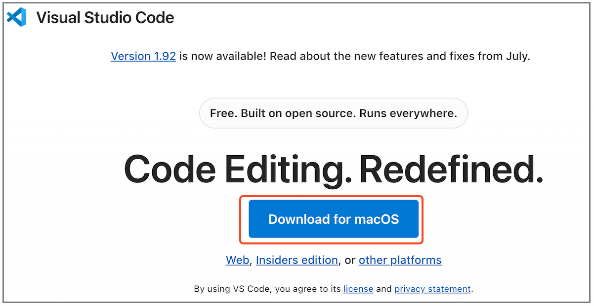
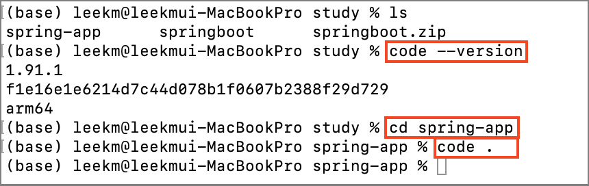
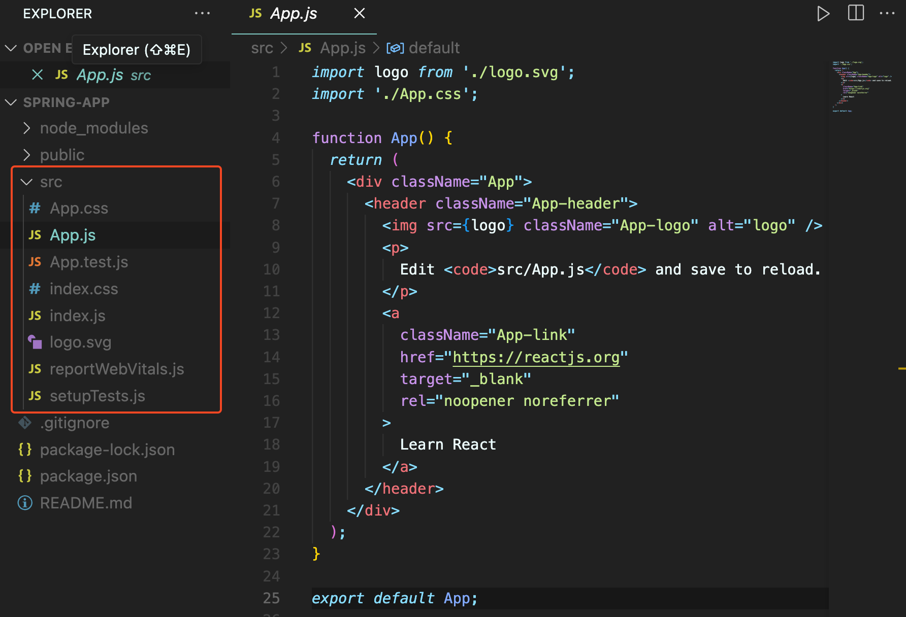

# 📘 React 연동 환경 설정

## 1. 학습 목표

- React 연동 환경에 대해 알아보기

## 2. React 연동 환경 설정

### 2.1 스프링 부트(Spring Boot)와 React를 연동하는 방법

**1. 독립된 서버 방식**: 스프링 부트 서버와 React 클라이언트가 각각 독립된 애플리케이션으로 동작하고, REST API로 통신하는 방식.

**2. 통합 방식**: React 프로젝트를 스프링 부트 프로젝트에 통합하여 하나의 애플리케이션으로 배포하는 방식.

일반적으로 개발 단계에서는 **독립된 서버 방식**이 더 유연하고, 배포 단계에서는 **통합 방식**이 단순합니다.

**[독립된 서버 방식]**

- **스프링 부트**: 백엔드 API 서버 역할을 하며, REST API를 제공.
- **React**: 프론트엔드 애플리케이션 역할을 하며, API로부터 데이터를 받아 사용자에게 표시.
    

### 2.2 스프링 부트(Spring Boot)와 React를 연동하는 방법

**1) node.js 설치하기 ::** [https://nodejs.org/en](https://nodejs.org/en)

  

**2) node.js 설치 후 확인**

  

**3) React 프로젝트 생성**

> **명령어 :: (sudo) npx create-react-app@5.1.0 {프로젝트명}**

명령어 > npx create-react-app@5.1.0 spring-app

<!--   -->
<!--    -->

 

**4) nodemon, axios 라이브러리 설치**

명령어 > npm install -g nodemon

  

명령어 > npm install axios

  

명령어 > npm install react-router-dom

  

### 2.3 VS Code 설치

**1) VS Code 공식 웹사이트 ::** [https://code.visualstudio.com/](https://code.visualstudio.com/)

  

**2) 설치한 VS Code에서 React 프로젝트 열기**

  

  
