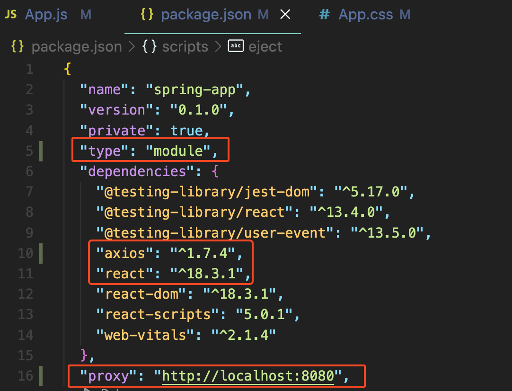

# 📘 사원 관리 화면 - 메인, 등록, 리스트 조회

## 1. 학습 목표

- 사원 관리 화면 생성하기

## 2. 사원 관리 화면 - 메인, 등록, 리스트 조회

<!-- [실행 결과]

 -->

### 2.1 package.json - import 타입, proxy 추가

<br><br>

<!--  -->

- 라이브러리가 추가되지 않은 경우 재설치 한다.

### 2.2 src/App.js

```jsx
import "./App.css";
import { useState, useEffect } from "react";
import axios from "axios";

export default function App() {
  const [page, setPage] = useState("home");

  function handleChangePage(page) {
    setPage(page);
  }

  return (
    <div className="App">
      <h1 className="App-title">사원관리 프로그램(React)</h1>
      {page === "home" && (
        <p>
          <span
            className="App-link"
            onClick={() => handleChangePage("register")}
          >
            사원 등록{" "}
          </span>
          <span className="App-link" onClick={() => handleChangePage("list")}>
            사원 리스트
          </span>
        </p>
      )}
      {page === "register" && (
        <EmployeeRegister handleChangePage={handleChangePage} />
      )}
      {page === "list" && <EmployeeList handleChangePage={handleChangePage} />}
    </div>
  );
}

/**
 * 사원 등록 컴포넌트
 */
function EmployeeRegister(props) {
  const [sno] = useState(Math.floor(Math.random() * 100000));
  const [name, setName] = useState("");
  const [address, setAddress] = useState("");

  function handleSignup() {
    //스프링 부트 호출 및 연동
    const data = {
      sno: sno,
      name: name,
      address: address,
    };

    axios
      .post("http://localhost:8080/api/employees/register", data)
      .then((response) => {
        if (response.data === "ok") {
          alert("가입이 완료되었습니다");
          props.handleChangePage("home");
        }
      })
      .catch((error) => {
        console.log(error);
      });
  }

  return (
    <div className="App">
      <form>
        <ul>
          <li>
            <label htmlFor="name">사번</label>
            <input
              type="text"
              id="sno"
              name="sno"
              placeholder="이름을 입력하세요"
              value={sno}
            />
          </li>
          <li>
            <label htmlFor="name">이름</label>
            <input
              type="text"
              id="name"
              name="name"
              placeholder="이름을 입력하세요"
              onChange={(e) => {
                setName(e.target.value);
              }}
            />
          </li>
          <li>
            <label htmlFor="name">주소</label>
            <input
              type="text"
              id="address"
              name="address"
              placeholder="주소을 입력하세요"
              onChange={(e) => {
                setAddress(e.target.value);
              }}
            />
          </li>
        </ul>
        <button type="button" onClick={handleSignup}>
          등록하기
        </button>
      </form>
    </div>
  );
}

/**
 * 사원 리스트 컴포넌트
 */
function EmployeeList(props) {
  const [employeeList, setEmployeeList] = useState([]);

  useEffect(() => {
    axios
      .get("http://localhost:8080/api/employees")
      .then((response) => {
        console.log(response.data);
        setEmployeeList(response.data);
      })
      .catch((error) => console.log(error));
  }, []);

  return (
    <div>
      <table className="App-memberList-table">
        <thead>
          <tr>
            <th>사원번호</th>
            <th>이름</th>
            <th>주소</th>
          </tr>
        </thead>
        <tbody>
          {employeeList.map((employee) => (
            <tr key={employee.sno}>
              <td>{employee.sno}</td>
              <td>{employee.name}</td>
              <td>{employee.address}</td>
            </tr>
          ))}
        </tbody>
      </table>
      <p>
        <span
          className="App-link"
          onClick={() => props.handleChangePage("home")}
        >
          홈으로
        </span>
        <span
          className="App-link"
          onClick={() => props.handleChangePage("register")}
        >
          사원 등록
        </span>
      </p>
    </div>
  );
}
```

### 2.3 src/App.css

```css
.App {
  text-align: center;
}

.App-title {
  text-align: center;
}

.App-link {
  width: 80px;
  display: inline-block;
}

.App-link:hover {
  text-decoration: underline;
}

.App-memberList-table th,
.App-memberList-table td {
  border: 1px solid gray;
  padding: 8px;
  text-align: center;
  /* table-layout: fixed; */
}

.App-memberList-table {
  width: 50%;
  margin: auto;
  border: 1px solid gray;
  border-collapse: collapse;
  table-layout: fixed;
}
```

### 2.4 React 프로젝트 실행

Terminal > New Terminal 실행

명령어 > nodemon start

<br><br>
<br><br>
