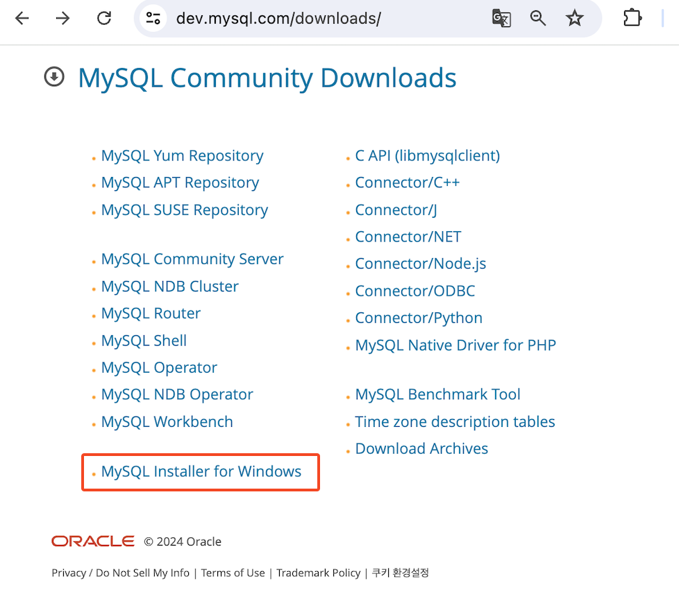
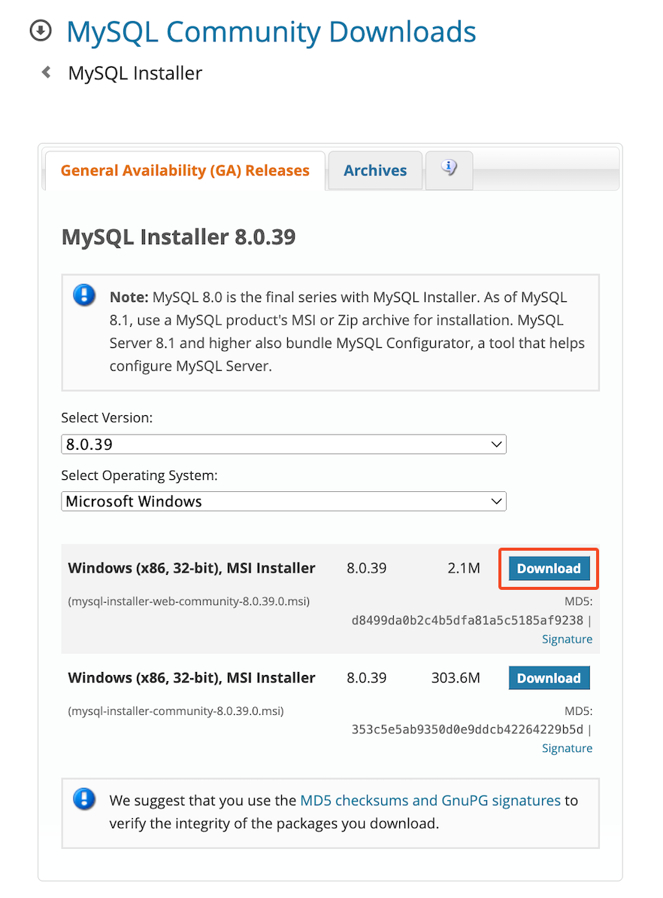
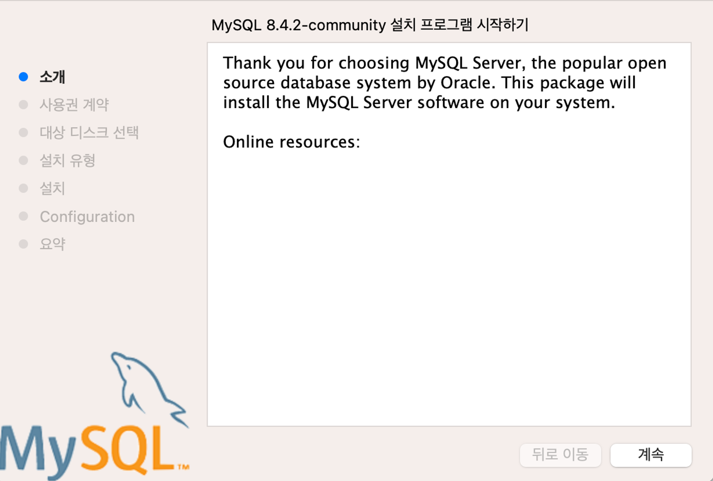
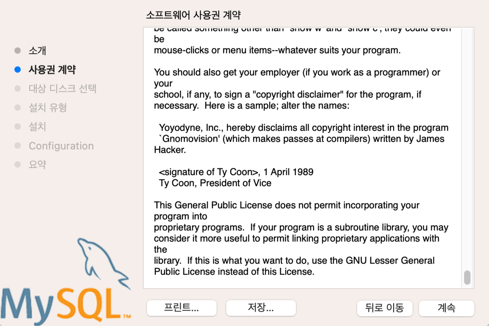
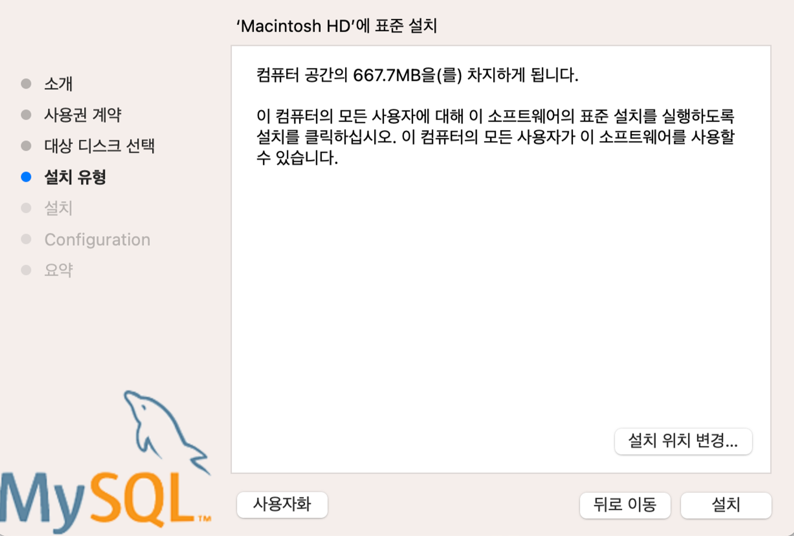
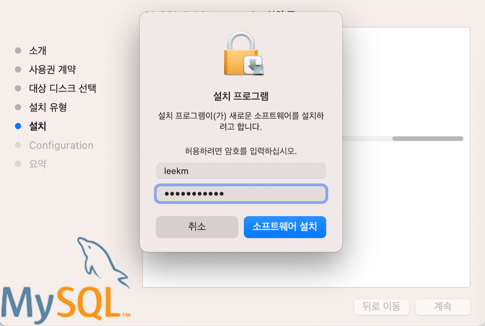
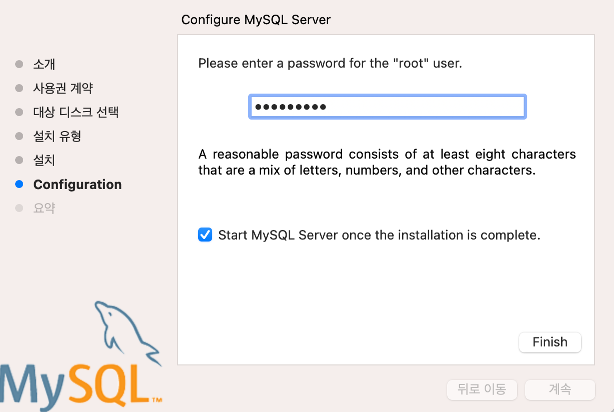
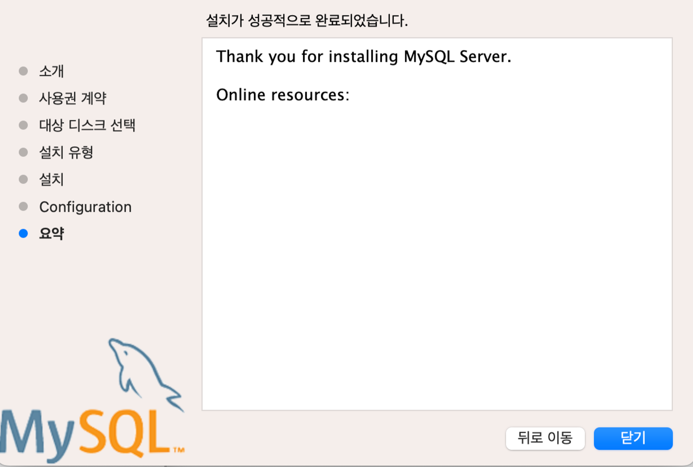
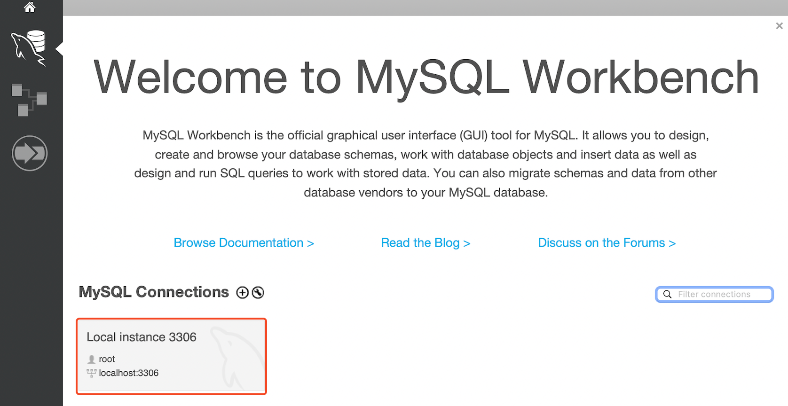
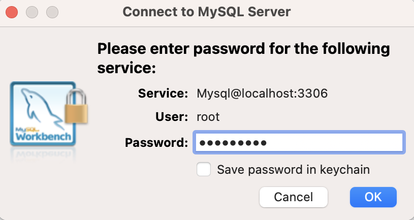

# 📘 MySQL 다운로드 및 설치 :: windows

## 1. 학습 목표

- MySQL을 설치 및 실행

## 2. MySQL 다운로드 및 설치 :: windows

### 2.1 MySQL 다운로드

- **다운로드 사이트 ::** [https://dev.mysql.com/downloads/](https://dev.mysql.com/downloads/)

  

  

### 2.2 MySQL + WorkBench 설치 - windows installer 다운로드 후 실행

  

  

  

  

  

- root 계정의 패스워드 입력 :: 8자리 이상 영문+숫자

  

### 2.3 MySQL 실행 확인 및 워크벤치 접속

  

  
