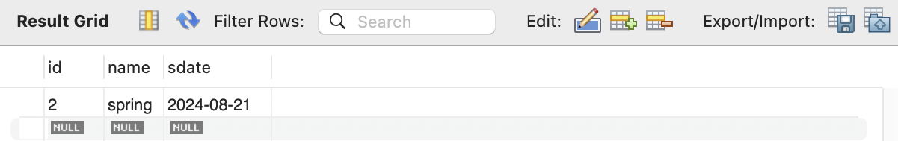
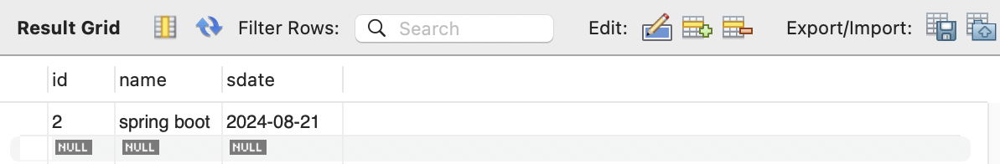
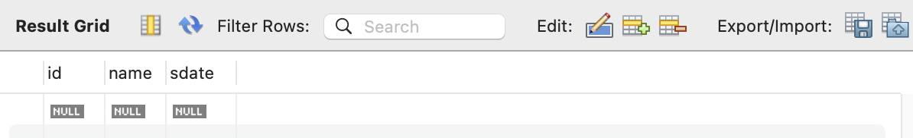

# 📘 SQL 명령어

## 1. 학습 목표

- SQL 익히기

## 2. SQL 명령어

### 2.1 데이터베이스, 테이블 생성

```sql
/** 데이터베이스 생성 */
create database hrdb_spring;

use hrdb_spring;
select database();

/** 테이블 생성 */
create table member (
	id		int		auto_increment primary key,
    name	varchar(255)	not null,
    sdate	date
);

show tables;
select * from member;
```

<br>

### 2.2 데이터 CRUD : insert, select, update, delete

```sql
/** 데이터 입력 */
insert into member(name, sdate)
	values('spring', now());

select * from member;
```

<br><br>

```sql
 /** 데이터 수정 */
update member set name='spring boot'
	where id = 2;

select * from member;
```

<br><br>

```sql
/** 데이터 삭제 */
delete from member where id = 2;

select * from member;
```

<br><br>
