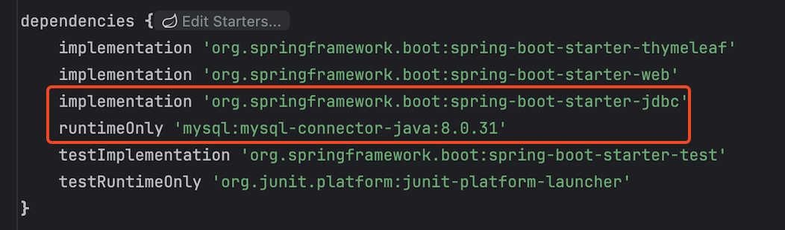
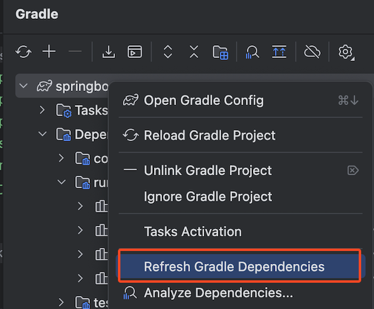
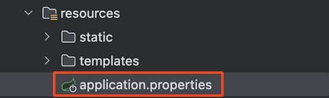
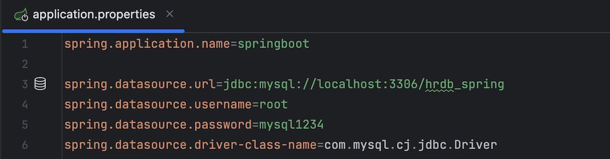

# 📘 스프링 jdbcTemplate 연동 설정

## 1. 학습 목표

- jdbcTemplate 연동 설정

## 2. 스프링 jdbcTemplate 연동 설정

💡 Spring JdbcTemplate 개념
`Spring JdbcTemplate`은 Spring Framework에서 제공하는 JDBC 추상화 라이브러리로, 개발자가 직접 JDBC API를 사용하지 않고 데이터베이스와 상호작용할 수 있도록 단순화된 접근 방식을 제공한다. 이 도구를 사용하면 데이터베이스 연결, SQL 쿼리 실행, 예외 처리, 자원 관리를 간편하게 처리할 수 있다.

- Spring JdbcTemplate 특징

* **코드 간소화**: JDBC를 직접 사용할 때 발생하는 반복 코드를 제거합니다.
* **트랜잭션 관리**: Spring의 트랜잭션 관리 기능과 쉽게 통합됩니다.
* **예외 처리**: JDBC 예외는 `SQLException`이라는 체크 예외로 던지지만, `JdbcTemplate`은 이를 런타임 예외로 변환해줍니다.
* **자동 자원 관리**: SQL 실행 후 자동으로 `ResultSet`, `Statement`, `Connection` 등의 자원을 해제합니다.
  <br><br>

### 2.1 MySQL JDBC 드라이버 추가

**1) 의존성 추가 : Maven, Gradle**

```java
/**
* 파일명 : build.gradle
*/
dependencies {
    implementation 'org.springframework.boot:spring-boot-starter-jdbc'
		runtimeOnly 'mysql:mysql-connector-java:8.0.31'
}
```

<br>

<br>

- Gradle 새로고침
  <br><br>

**2) JAR 파일 추가**

- 드라이버 추가 확인
  - File > Project Structure (Ctrl+Alt+Shift+S) > Modules
  - Dependencies 탭에서 MySQL Connector/J가 포함되어 있는지 확인
- 공식사이트에서 다운로드 : [https://downloads.mysql.com/archives/c-j/](https://downloads.mysql.com/archives/c-j/)

<br><br>

- 다운로드한 파일의 압축을 풀면 .jar 파일의 드라이버가 존재함

- JAR 파일 추가

  - `File` 메뉴에서 `Project Structure` (또는 단축키 `Ctrl+Alt+Shift+S`)를 선택
  - `Modules`를 선택한 후, 오른쪽 패널에서 `Dependencies` 탭을 클릭.
  - `+` 버튼을 클릭하고 `JARs or directories`를 선택
  - `lib` 디렉토리에서 `mysql-connector-java-8.0.39.jar` 파일을 선택
  - `Apply`와 `OK`를 클릭하여 변경 사항을 저장

- 프로젝트 Clean & Rebuild
  - IntelliJ IDEA에서 `Build` 메뉴로 가서 `Rebuild Project`를 선택
  - `File` 메뉴에서 `Invalidate Caches / Restart`를 선택하고, `Invalidate and Restart` 버튼을 클릭
    <br><br>

### 2.2 MySQL 연동 정보 추가 : application.properties

<br>

```java
spring.datasource.url=jdbc:mysql://localhost:3306/hrdb_spring
spring.datasource.username=root
spring.datasource.password=mysql1234
spring.datasource.driver-class-name=com.mysql.cj.jdbc.Driver
```

<br><br>

- 드라이버에 빨간색이 뜨면 드라이버 추가 오류가 발생했으므로 반드시 해결해야함
