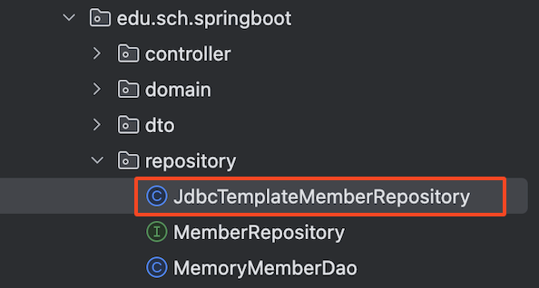

# 📘 스프링 jdbcTemplate

## 1. 학습 목표

- jdbcTemplate 실행

## 2. 스프링 jdbcTemplate

💡 jdbcTemplate API 주소
:: <br> [https://docs.spring.io/spring-framework/docs/current/javadoc- api/org/springframework/jdbc/core/JdbcTemplate.html](https://docs.spring.io/spring-framework/docs/current/javadoc-api/org/springframework/jdbc/core/JdbcTemplate.html)

<br>

### 2.1 EmployeeRepositoryInterface.java

```
package com.sch.springboot.repository;

import com.sch.springboot.dto.Employee;

import java.util.List;

public interface EmployeeRepositoryInterface {
    List<Employee> selectAll();
    int insert(Employee employee);
}

```

### 2.2 JdbcTemplateEmployeeRepository.java

<!-- <br><br> -->

```java
package com.sch.springboot.repository;

import com.sch.springboot.dto.Employee;
import org.springframework.jdbc.core.BeanPropertyRowMapper;
import org.springframework.jdbc.core.RowMapper;
import org.springframework.jdbc.core.JdbcTemplate;
import org.springframework.stereotype.Repository;

import javax.sql.DataSource;
import java.util.ArrayList;
import java.util.List;

@Repository
public class JdbcTemplateEmployeeRepository implements EmployeeRepositoryInterface {
    //사원객체를 저장하는 List<Employee>
    private List<Employee> list = new ArrayList<Employee>();
    private final JdbcTemplate jdbcTemplate;

    public JdbcTemplateEmployeeRepository(DataSource dataSource) {
        this.jdbcTemplate = new JdbcTemplate(dataSource);
    }

    /** 사원 등록 */
    @Override
    public int insert(Employee employee) {
        String sql = "insert into employee (name, address, department) VALUES (?, ?, ?)";
        int rows = jdbcTemplate.update(sql, employee.getName(), employee.getAddress(), employee.getDepartment());
        return rows;
    }

    /** 사원 리스트 조회 */
    @Override
    public List<Employee> selectAll() {
        String sql = "SELECT sno, name, address, department FROM employee";
        return jdbcTemplate.query(sql,
                BeanPropertyRowMapper.newInstance(Employee.class));
    }
}

```

<br>

### 2.3 EmployeeService.java

- memberDao 객체의 클래스 타입 ⇒ JdbcTemplateMemberRepository 클래스 타입으로 수정

```java
package com.sch.springboot.service;

import com.sch.springboot.dto.Employee;
import com.sch.springboot.repository.EmployeeRepository;
import com.sch.springboot.repository.JdbcTemplateEmployeeRepository;
import org.springframework.beans.factory.annotation.Autowired;
import org.springframework.stereotype.Service;

import java.util.List;

@Service
public class EmployeeService {

    private final JdbcTemplateEmployeeRepository employeeRepository;

    @Autowired
    public EmployeeService(JdbcTemplateEmployeeRepository employeeRepository) {
        this.employeeRepository = employeeRepository;
    }

    //사원리스트
    public List<Employee> findAll(){
        return employeeRepository.selectAll();
    }

    //사원등록
    public int register(Employee employee) {
        return employeeRepository.insert(employee);
    }
}


```

### 2.4 React - App.js

- 사원등록 결과 : rows 값으로 리턴

```
 axios
      .post("http://localhost:8080/api/employees/register", data)
      .then((response) => {
        // console.log(response.data);
        if (response.data === 1) {
          alert("가입이 완료되었습니다");
          props.handleChangePage("home");
        }
      })
      .catch((error) => {
        console.log(error);
      });
```
