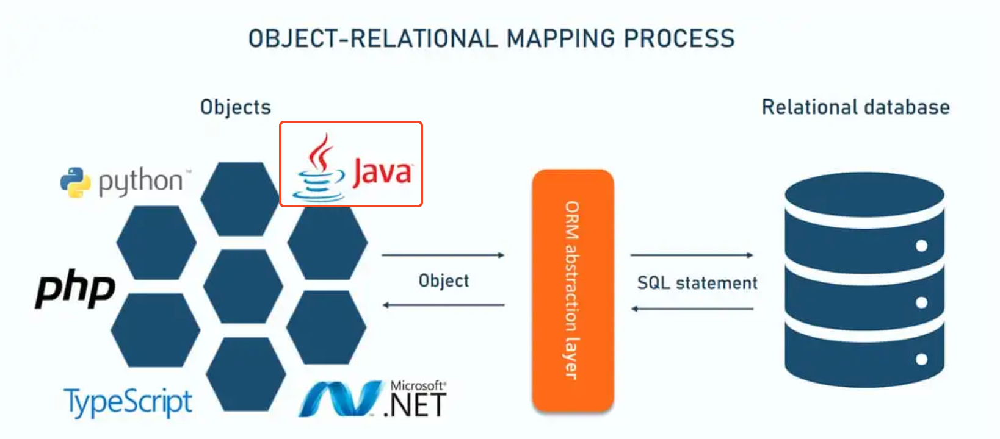
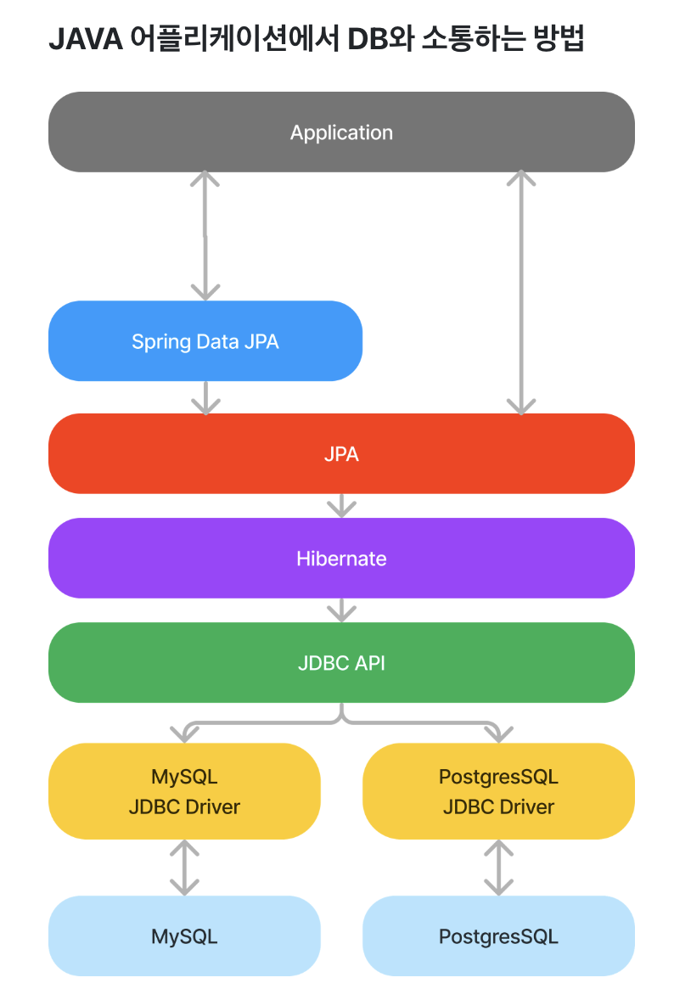
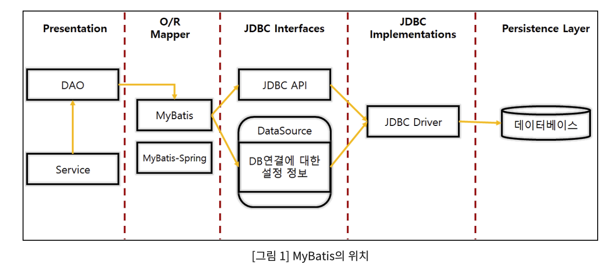

# 📘 ORM(Object Relational Mapping) 정리

## 1. 학습 목표

- ORM(Object Relational Mapping) 익히기

## 2. ORM(Object Relational Mapping) 정리

### 2.1 ORM 이란?

 
출처: [https://www.altexsoft.com/blog/object-relational-mapping-tools](https://www.altexsoft.com/blog/object-relational-mapping-tools)
  

  

- 정의
  - ORM(Object-Relational Mapping)은 객체 지향 프로그래밍 언어에서 관계형 데이터베이스의 데이터를 쉽게 다룰 수 있도록 객체와 데이터베이스의 테이블 간의 매핑을 제공하는 기술입니다. 이 기술은 데이터베이스의 테이블을 객체로, 그 테이블의 레코드를 객체의 인스턴스로 변환해줍니다.
- ORM 주요 개념
  - **엔티티(Entity)**: 데이터베이스 테이블에 매핑되는 클래스
  - **필드(Field)**: 데이터베이스의 컬럼에 매핑되는 클래스의 속성
  - **영속성(Persistence)**: 객체를 데이터베이스에 저장하거나, 데이터베이스에서 데이터를 가져오는 작업
  - **매핑(Mapping)**: 객체와 테이블, 객체의 필드와 테이블의 컬럼을 연결하는 것
- ORM 장점

  - **생산성 향상**: 반복적인 SQL 작성 작업을 줄여줍니다.
  - **유지보수성**: SQL 로직이 아닌 객체 지향 코드로 로직을 구성하기 때문에 코드 유지보수성이 높아집니다.
  - **데이터베이스 독립성**: DBMS에 종속적이지 않아, DB 변경 시 최소한의 수정만으로도 동작이 가능합니다.

- ORM 단점
  - **복잡한 쿼리 처리 어려움**: 고도의 SQL 최적화가 필요한 경우 자동 생성된 쿼리가 비효율적일 수 있습니다.
  - **추가적인 추상화 계층**: 성능 저하가 발생할 수 있습니다.
      

### 2.2 MyBatis 개념과 ORM에서의 역할

- MyBatis란?
  - MyBatis는 자바 객체와 SQL 데이터베이스 간의 매핑을 제공하는 **SQL 기반의 데이터 매핑 프레임워크**입니다. MyBatis는 기본적으로 SQL을 직접 작성하면서 자바 객체와 데이터베이스 간의 매핑 작업을 수행합니다. 이를 통해 **SQL 제어권을 개발자에게 그대로 주면서도** 반복적인 코드를 줄이고, 데이터베이스와의 상호작용을 간편하게 만듭니다.
  - MyBatis는 **JPA/Hibernate와 같은 풀 ORM**이 아니지만, SQL과 객체 매핑을 지원하는 반(半) ORM 프레임워크로 분류됩니다. MyBatis는 SQL을 직접 작성하는 것을 중요하게 여기며, **복잡한 쿼리의 효율적인 실행을 위해 SQL의 자유도를 높게 보장**합니다.

  

- ORM과 MyBatis의 차이점

|                      | **ORM (Hibernate, JPA)**                     | **MyBatis**                                  |
| -------------------- | -------------------------------------------- | -------------------------------------------- |
| **SQL 제어**         | 자동 생성 (추상화)                           | 직접 작성 (자유로운 제어)                    |
| **객체 매핑**        | 자동 매핑 (Entity와 테이블 매핑)             | 수동 매핑 (SQL과 객체 수동 매핑)             |
| **트랜잭션 관리**    | 자동 관리                                    | 수동 관리                                    |
| **복잡한 쿼리 처리** | 제한적 (HQL/JPQL)                            | 매우 유연 (SQL 직접 작성)                    |
| **성능 최적화**      | 최적화 어려움 (추상화로 인한 성능 이슈 가능) | 최적화 가능 (직접 SQL 제어로 성능 개선 가능) |

- MyBatis의 특징
  1. **SQL 중심의 개발**: MyBatis는 개발자가 직접 SQL을 작성하는 방식이기 때문에, SQL의 모든 기능과 데이터베이스 특화 기능을 자유롭게 사용할 수 있습니다. 복잡한 쿼리, 스토어드 프로시저 등도 쉽게 처리할 수 있습니다.
  2. **SQL과 객체 매핑**: MyBatis는 SQL 쿼리의 결과를 자바 객체와 매핑해주는 기능을 제공합니다. `ResultMap`이라는 매핑 도구를 사용하여 SQL 결과를 자바 객체로 변환합니다.
  3. **XML 매핑과 어노테이션 지원**: MyBatis는 SQL 매핑을 XML 파일로 정의할 수 있으며, 어노테이션 기반의 매핑도 지원합니다.
  4. **플렉서블한 SQL**: 조건문이나 반복문 등 프로그램 로직에 따라 동적으로 SQL을 생성할 수 있는 기능을 제공합니다. 이는 복잡한 SQL 쿼리 작성 시 매우 유용합니다.
  5. **자동으로 CRUD 코드 생성**: 반복적인 데이터베이스 작업에 대해 자동으로 CRUD 메서드를 생성할 수 있는 도구를 제공하여 개발 생산성을 높입니다.
