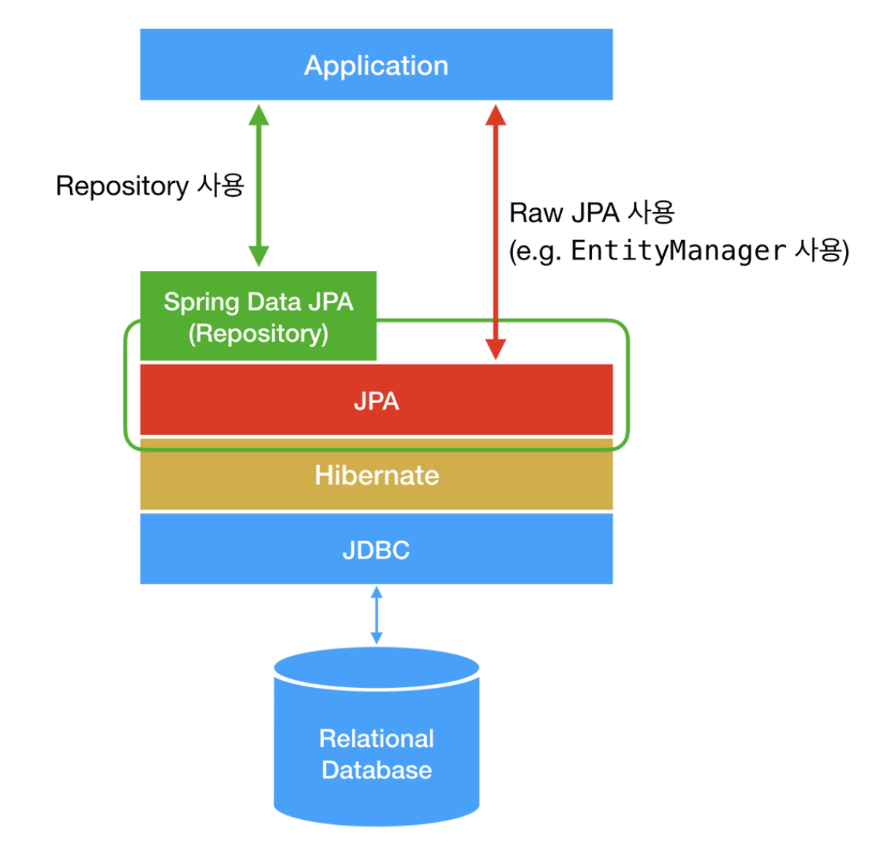
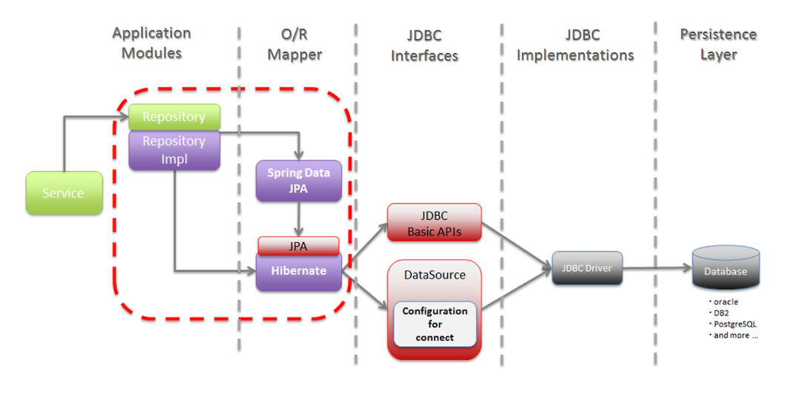
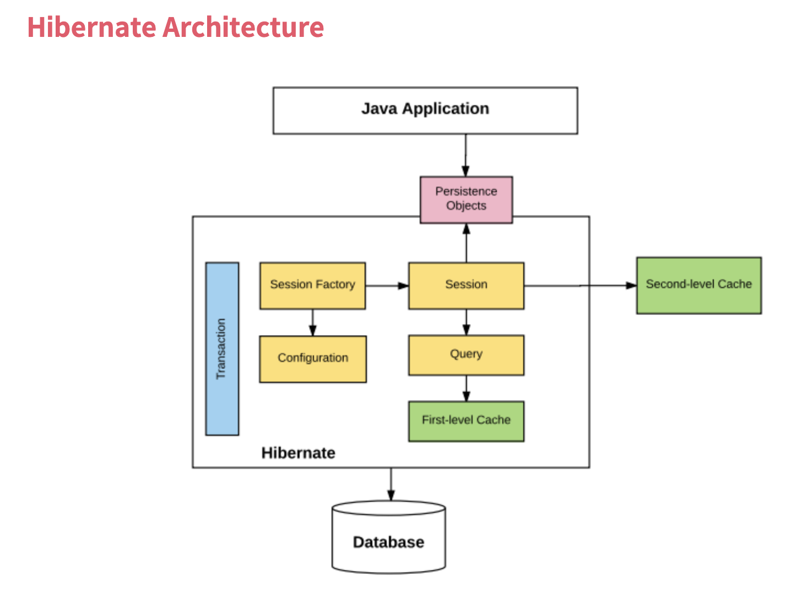

# 📘 JPA(Java Persistence API) 정리

## 1. 학습 목표

- JPA(Java Persistence API) 정리

## 2. JPA(Java Persistence API) 정리

### 2.1 JPA란?

  

  

- 정의
  - JPA(Java Persistence API)는 자바에서 관계형 데이터베이스를 사용할 수 있도록 표준화된 ORM(Object-Relational Mapping) 프레임워크이다. 데이터베이스와 객체 간의 매핑을 자동화하여, SQL을 직접 작성하지 않고도 자바 객체와 데이터베이스 간의 데이터를 효율적으로 관리할 수 있다.
  - **JPA는 SQL 중심이 아닌 객체 중심으로 데이터베이스 작업을 처리**할 수 있도록 설계되었다.
- JPA의 핵심 개념
  - **엔티티(Entity):**
    데이터베이스의 테이블과 매핑되는 자바 클래스이다. 엔티티 클래스는 데이터베이스의 한 테이블에 해당하고, 엔티티의 각 필드는 테이블의 컬럼에 매핑된다.
  - **영속성 컨텍스트(Persistence Context):**
    엔티티 객체를 관리하는 일종의 "캐시"이다. JPA는 영속성 컨텍스트를 통해 객체를 저장, 수정, 삭제, 조회하는 작업을 관리한다.
  - **엔티티 매니저(EntityManager):**
    영속성 컨텍스트를 관리하는 핵심 클래스이다. 엔티티 객체의 CRUD 작업을 처리한다.
  - **트랜잭션(Transaction):**
    데이터베이스의 작업을 논리적으로 묶어서 처리하는 단위이다. JPA는 트랜잭션 내에서 데이터베이스에 대한 작업이 이루어져야 데이터의 일관성이 보장된다.
- JPA 장점

  - **객체 중심의 설계:** 데이터베이스와 객체 간의 불일치를 해소하여, 객체 모델링을 데이터베이스에 반영할 수 있다.
  - **생산성 향상:** SQL 문을 작성하지 않고 자바 코드만으로 데이터베이스 작업을 처리할 수 있다.
  - **데이터베이스 독립성:** 특정 데이터베이스에 종속되지 않으며, 데이터베이스가 변경되어도 코드 수정이 적다.
  - **자동 트랜잭션 관리:** 트랜잭션 처리가 용이하며, 코드에서 명시적으로 관리하지 않아도 된다.

- JPA 주요 어노테이션
  - **`@Entity`:** 이 클래스를 JPA 엔티티로 선언한다.
  - **`@Table`:** 엔티티와 매핑되는 데이터베이스 테이블을 지정한다.
  - **`@Id`:** 엔티티의 기본 키를 지정한다.
  - **`@GeneratedValue`:** 기본 키의 생성 전략을 지정한다. (예: `AUTO`, `IDENTITY`, `SEQUENCE`, `TABLE`)
  - **`@Column`:** 특정 필드가 테이블의 컬럼과 매핑되도록 지정한다.
  - **`@OneToOne`, `@OneToMany`, `@ManyToOne`, `@ManyToMany`:** 엔티티 간의 관계를 지정한다.

  

### 2.2 Hibernate란?

  

- 정의

  - **Hibernate**는 자바의 ORM(Object-Relational Mapping) 프레임워크로, 자바 객체와 관계형 데이터베이스 간의 매핑을 자동으로 처리해주는 도구이다. SQL을 직접 작성하지 않고도, 객체 지향적인 방식으로 데이터베이스와 상호작용할 수 있도록 도와준다. Hibernate는 **JPA(Java Persistence API)**의 구현체 중 하나로, 표준 JPA API를 확장하여 강력한 기능을 제공한다.

- Hibernate의 주요 기능

  1. **객체와 테이블 간 매핑**: 엔티티 클래스에 어노테이션을 추가하여 자동으로 데이터베이스 테이블과 매핑한다.
  2. **자동 쿼리 생성**: CRUD 작업 시 Hibernate는 자동으로 SQL 쿼리를 생성하고 실행한다. 이는 개발자가 직접 SQL을 작성하지 않아도 되는 장점이 있다.
  3. **캐싱 기능**: Hibernate는 1차 캐시와 2차 캐시를 지원하여, 동일한 데이터를 여러 번 조회할 때 성능을 높여준다.
  4. **Lazy Loading**: 연관된 엔티티를 필요할 때만 조회하여 성능을 최적화하는 기능으로 기본적으로 지연 로딩이 설정된다.
  5. **트랜잭션 관리**: 트랜잭션을 자동으로 관리하여 데이터베이스의 일관성을 보장한다. 트랜잭션 내에서 모든 작업이 완료되거나 롤백될 수 있다.
  6. **HQL 지원**: SQL과 유사하지만 객체 중심의 Hibernate Query Language를 제공하여 객체 모델을 직접 질의할 수 있다.

- Hibernate의 장점과 단점
  - 장점
    1. **생산성 향상**: 개발자는 SQL 대신 객체를 조작함으로써 코드의 간결성을 높일 수 있다.
    2. **유지보수 용이**: 데이터베이스에 의존하지 않고 객체 지향 프로그래밍 방식으로 작업이 가능해 유지보수가 용이하다.
    3. **데이터베이스 독립성**: 데이터베이스에 대한 의존성을 낮춰 DBMS를 변경해도 큰 수정 없이 코드가 동작한다.
  - 단점
    1. **복잡한 쿼리 한계**: Hibernate는 자동으로 생성된 쿼리를 사용하기 때문에 매우 복잡하거나 성능이 중요한 쿼리에서는 비효율적일 수 있다.
    2. **초기 학습 곡선**: ORM의 개념과 Hibernate의 다양한 기능을 이해하는 데 시간이 걸릴 수 있다.
