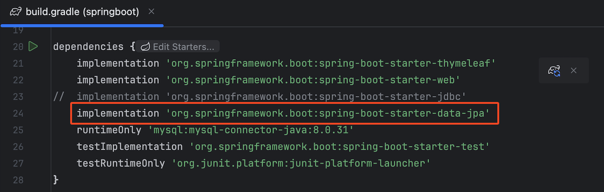
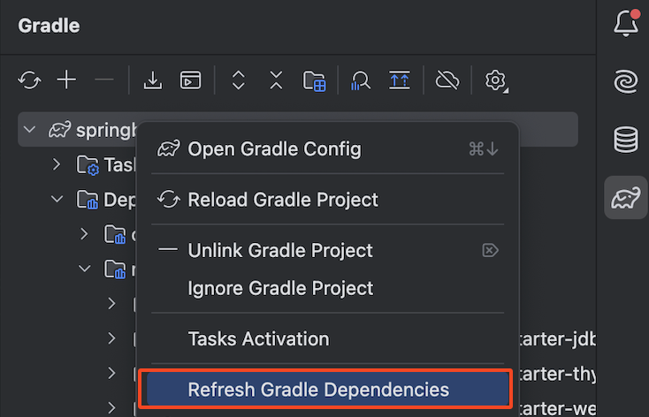
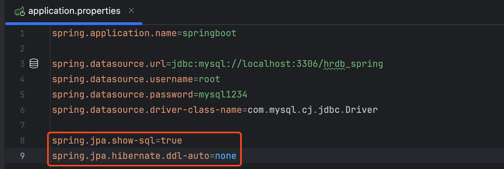

# 📘 JPA 실습

## 1. 학습 목표

- JPA(Java Persistence API) 실습

## 2. JPA 실습

### 2.1 JPA 라이브러리 의존성 추가

- build.gradle

```java
  implementation 'org.springframework.boot:spring-boot-starter-data-jpa'
	runtimeOnly 'mysql:mysql-connector-java:8.0.31'
```

<br><br>

- Gradle 리프레쉬

<br><br>

- application.properties 추가

```java
spring.jpa.show-sql=true
spring.jpa.hibernate.ddl-auto=none
```

<br><br>

### 2.2 Entity 객체 생성

- 라이브러리 설치 확인 - External Libraries
- 기존 dto/Employee.java ⇒ Entitly 객체로 전환

```java
package com.sch.springboot.dto;

import jakarta.persistence.Entity;
import jakarta.persistence.GeneratedValue;
import jakarta.persistence.GenerationType;
import jakarta.persistence.Id;

@Entity
public class Employee {

    @Id
    private Long sno;
    private String name;
    private String department;
    private String address;

    public Long getSno() {
        return sno;
    }

    public void setSno(Long sno) {
        this.sno = sno;
    }

    public String getName() {
        return name;
    }

    public void setName(String name) {
        this.name = name;
    }

    public String getDepartment() {
        return department;
    }

    public void setDepartment(String department) {
        this.department = department;
    }

    public String getAddress() {
        return address;
    }

    public void setAddress(String address) {
        this.address = address;
    }
}

```

### 2.3 JPA용 Repository 객체 생성

- EmployeeRepositoryInterface.java : insert 메소드 리턴 타입을 Long으로 수정

```java
package com.sch.springboot.repository;

import com.sch.springboot.dto.Employee;

import java.util.List;

public interface EmployeeRepositoryInterface {
    List<Employee> selectAll();
    Long insert(Employee employee);
}

```

- repository/JpaEmployeeRepository.java

```java
package com.sch.springboot.repository;

import com.sch.springboot.dto.Employee;
import jakarta.persistence.EntityManager;
import org.springframework.stereotype.Repository;
import java.util.List;

@Repository
public class JpaEmployeeRepository implements EmployeeRepositoryInterface {

    private final EntityManager em;

    public JpaEmployeeRepository(EntityManager em) {
        this.em = em;
    }

    /** 사원 등록 */
    @Override
    public Long insert(Employee employee) {
        em.persist(employee);
        return employee.getSno();
    }

    /** 사원 리스트 조회 */
    @Override
    public List<Employee> selectAll() {
        return em.createQuery("select m from Employee m", Employee.class)
                .getResultList();
    }
}


```

### 2.4 Service 객체 수정

1. `@Transactional` 어노테이션 추가

- JPA를 사용하여 데이터를 저장하거나 업데이트 할때는 반드시 트랜잭션 작업이 필요함

```java
package com.sch.springboot.service;

import com.sch.springboot.dto.Employee;
import com.sch.springboot.repository.JpaEmployeeRepository;
import org.springframework.beans.factory.annotation.Autowired;
import org.springframework.stereotype.Service;
import org.springframework.transaction.annotation.Transactional;

import java.util.List;

@Transactional
@Service
public class EmployeeService {

    private final JpaEmployeeRepository employeeRepository;

    @Autowired
    public EmployeeService(JpaEmployeeRepository employeeRepository) {
        this.employeeRepository = employeeRepository;
    }

    //사원리스트
    public List<Employee> findAll(){
        return employeeRepository.selectAll();
    }

    //사원등록
    public Long register(Employee employee) {
        return employeeRepository.insert(employee);
    }
}

```

### 2.5 App.js

```javascript
axios
  .post("http://localhost:8080/api/employees/register", data)
  .then((response) => {
    // console.log(response.data);
    if (response.data !== 0) {
      alert("가입이 완료되었습니다");
      props.handleChangePage("home");
    }
  })
  .catch((error) => {
    console.log(error);
  });
```
